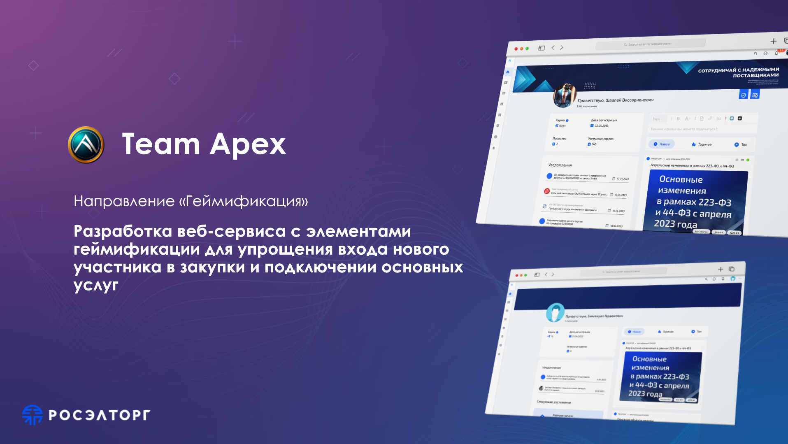

# Интерфейс социальной сети  для РОСЭЛТОРГ в рамках хакатона `Разработка веб-сервиса с элементами геймификации для упрощения входа нового участника в закупки и подключении основных услуг` 

   

<a href="https://main--precious-tarsier-056da5.netlify.app"> ссылка на демо</a>

## Используемые технологии  
React - фреймворк для создания SPA   
Antd Design - UI-Kit 
React-joyride- Анбординг приложения при первом входе 

